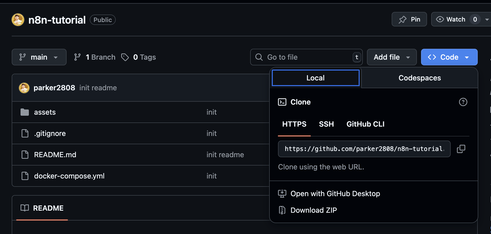

# Clone and Setup N8N with Docker and VSCode

## Prerequisites

Make sure you have completed:

- [Docker Desktop installation](../01-setup/01-docker-desktop.md)
- [VSCode installation](../02-vscode/01-install-vscode.md)

## Setup Steps

### 1. Clone the Repository

Clone this repository using one of these methods:

#### Option A: Manual Download

1. Click on the `Code` button in the repository
2. Click `Download ZIP`
3. Extract the ZIP file to your desired location



#### Option B: Git Clone

```shell
git clone https://github.com/parker2808/n8n-tutorial.git
```

### 2. Open Project in VSCode

1. Open `VSCode`
2. Go to `File` → `Open Folder`
3. Select the `n8n-tutorial` folder

### 3. Start N8N Server

1. In `VSCode`, open terminal by shortcut `Ctrl/Command + J`
2. Run the following commands:

#### Start N8N Server

```shell
docker-compose up -d
```

#### Stop/Remove N8N Server (Optional - Execute this command when the N8N server is no longer needed)

```shell
docker-compose down
```

### 4. Access N8N

1. Open your web browser
2. Navigate to [http://localhost:5678](http://localhost:5678)
3. Sign up for your `n8n` account

### 5. Troubleshooting

If you cannot access the link in step 4:

1. Remove the `n8n_data` folder
2. Run the `down` server command
3. Re-do from step 3

### 6. Sign Up and Activate N8N Account

1. **Create Your N8N Account**

   Follow the N8N setup wizard to create your account:

   

   **Important**: Choose the option `Send me a free license key` to proceed with the next step.

   

2. **Activate Your License**

   Wait a moment to receive the activation email from N8N, then click `Active License Key` to activate your N8N free trial plan.

   

3. **Complete Setup**

   After all configuration is complete, you have successfully created your N8N self-hosted instance. Navigate to the [Home Page](http://localhost:5678/home/workflows) and you're ready to create workflows!

## Next Steps

Once N8N is running successfully, proceed to [Get Access Token](../04-authentication/get-access-token.md).
